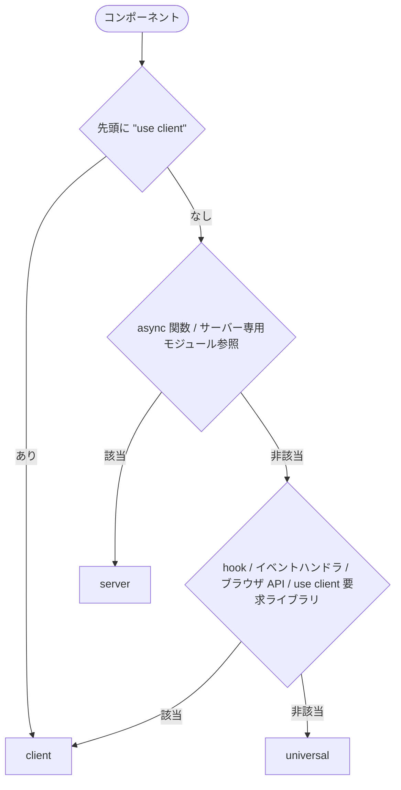

# ファイル命名（Next.js）

共通ルールは [ファイル命名](./ファイル命名.md) を参照。本ファイルでは、その共通ルールを前提に Next.js 固有のサフィックス命名を定義する。共通ルールどおり、ファイル名はケバブケースで命名し（例: `user-profile.server.tsx`）、種類はサフィックスで表す。

Next.js の file convention（`page.tsx` / `layout.tsx` / `route.ts` など、フレームワークが予約するファイル名）は本ルールの対象外とする。

## 方針

- コンポーネントやモジュールは、種別・役割を表すサフィックス（`*.server.tsx` / `*.container.server.tsx` / `*.data.ts` など）をファイル名に付けて命名する
- 種別（server / client / universal）は下記の判定フローに従って決定し、命名一覧のパターンに沿ってファイル名を付ける

## コンポーネントの種別判定フロー

上から順に評価し、**最初に該当した区分を採用する**。

1. ファイル先頭に `"use client"` がある → **client**
2. 以下のいずれかを使う → **server**
   - `async` 関数として宣言されている
   - サーバー専用モジュール（`next/headers`、DB クライアント、シークレット環境変数など）の参照
3. 以下のいずれかを使う → **client**（`"use client"` を付与）
   - React の hook を使う（`useState` / `useEffect` / `useRef` / `useContext` 等）
   - イベントハンドラ（`onClick` 等）の直接定義
   - ブラウザ専用 API（`window` / `document` / `localStorage` 等）
   - 内部で `"use client"` を要求するライブラリ
4. 上記いずれにも該当しない（props を受けて JSX を返すだけ、子に client component を含むだけ） → **universal**

## 命名一覧

| 区分 | 命名パターン |
| --- | --- |
| サーバーコンポーネント | `*.server.tsx` |
| クライアントコンポーネント | `*.client.tsx` |
| ユニバーサルコンポーネント | `*.universal.tsx` |
| スケルトンコンポーネント | `*.skeleton.[server\|client\|universal].tsx` |
| container コンポーネント | `*.container.[server\|client\|universal].tsx` |
| presenter コンポーネント | `*.presenter.[server\|client\|universal].tsx` |
| form コンポーネント | `*.form.client.tsx` |
| Server Action | `*.action.ts` |
| RSC 用データフェッチ | `*.data.ts` |
| サーバー専用ユーティリティ（コンポーネント以外） | `*.server.ts` |

`*.server.ts` は、コンポーネント以外のモジュールのうち、判定フローのステップ 2（サーバー専用モジュールの参照など）で **server** と判定されるものに付与する。

## テストファイル

### server テスト（node 環境）

| 区分 | 命名パターン |
| --- | --- |
| small（外部依存なし） | `*.small.server.test.ts` |
| medium（DB など外部依存あり） | `*.medium.server.test.ts` |

### client テスト（browser mode）

| 区分 | 命名パターン |
| --- | --- |
| hook・スクリプト | `*.client.test.ts` |
| コンポーネント | `*.client.test.tsx` |

### 対象外

- サーバーコンポーネント自体はテスト対象外
- E2E は別チケットで対応
